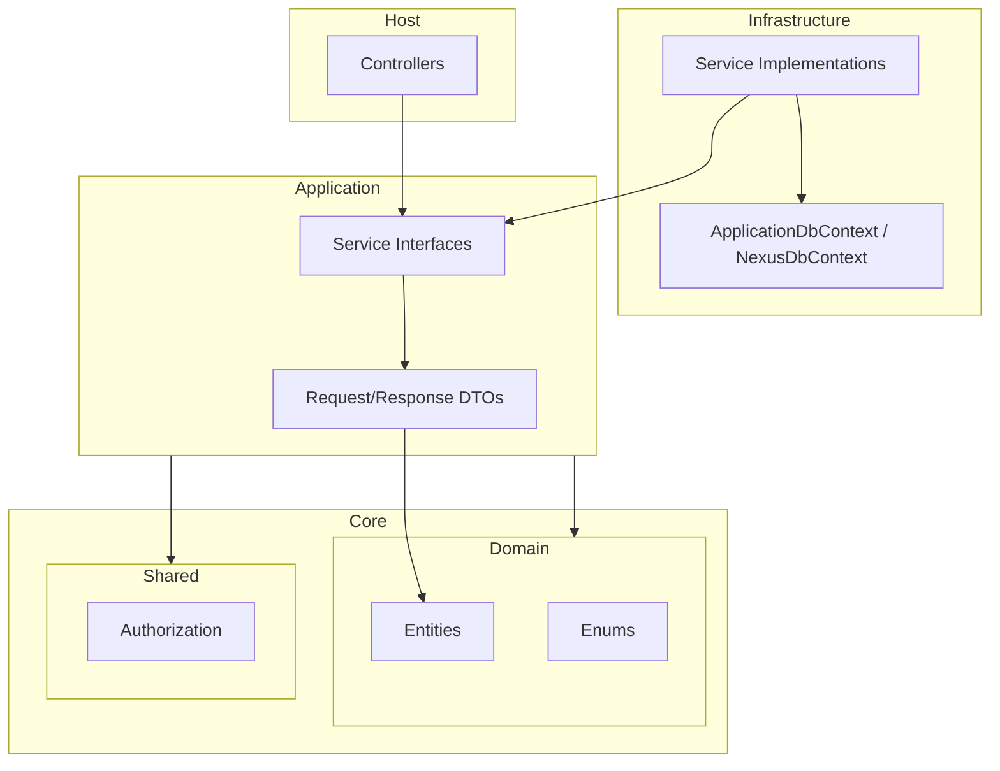

# Current Architecture

This document describes the current architecture of the system. It is a factual reference for how the system is structured and how components interact.

---

## 1. Solution Structure

### Projects

| Project | Location | Purpose |
|---------|----------|---------|
| Domain | `src/Core/Domain/` | Entities, enums. Depends only on Shared. |
| Application | `src/Core/Application/` | Service interfaces, Request/Response DTOs. |
| Shared | `src/Core/Shared/` | Authorization, validation messages. |
| Infrastructure | `src/Infrastructure/` | Service implementations, DbContexts, auth, persistence. |
| Host | `src/Host/` | Controllers, Program.cs, configuration. |
| Migrators.MSSQL | `src/Migrators/Migrators.MSSQL/` | EF Core migrations for SQL Server. |
| Migrators.PostgreSQL | `src/Migrators/Migrators.PostgreSQL/` | EF Core migrations for PostgreSQL. |

### Dependency Flow

```
Host → Application, Infrastructure, Migrators.MSSQL
Infrastructure → Application, Domain, Shared
Application → Domain, Shared
Domain → Shared
```

---

## 2. Layer Descriptions

### Domain (`src/Core/Domain/`)

- **Entities**: Extend `AuditableEntity` (or `BaseEntity` if no audit needed).
- **AuditableEntity** adds: `CreatedBy`, `CreatedOn`, `FKLastModifiedBy`, `LastModifiedOn`, `DeletedOn`, `FKDeletedBy`, `IsDeleted`, `TenantId`.
- **Entity naming**: Plural (e.g. `FormStructures`, `FormPages`).
- **Enums**: In `Domain/Enums/{ModuleName}/`.
- **DefaultIdType**: `int` (from `Directory.Build.props`).
- **Dependencies**: None except Shared.

### Application (`src/Core/Application/`)

- **Service interfaces**: `I{Entity}Service` extending `ITransientService` or `IScopedService`.
- **Request DTOs**: `Create{Entity}Request`, `Update{Entity}Request`, `Search{Entity}Request` (extends `SearchRequestBaseClass`).
- **Response DTOs**: `Create{Entity}Response`, `View{Entity}DetailResponse`.
- **Common**: `PaginationResponse<T>`, `SearchRequestBaseClass`, `NotFoundException`, `BadRequestException`, `ICurrentUser`, `IDateTimeService`, etc.
- **Dependencies**: Domain, Shared. Does NOT reference Infrastructure.

### Shared (`src/Core/Shared/`)

- **Authorization**: `SystemAction`, `SystemResource`, `SystemPermission`, `MustHavePermissionAttribute`.
- **Validation**: `ValidationMessages`.
- **Dependencies**: None.

### Infrastructure (`src/Infrastructure/`)

- **Orbit/**: Application-domain services (FormDesigner, LookUp, Email, Appointment, Setting).
- **Nexus/**: Cross-cutting services (Identity, MultiTenant, Localization, Subscription, Lookup).
- **Services**: Inject `ApplicationDbContext` or `NexusDbContext` directly (no repository).
- **Data access**: `DbSet<>`, `PaginatedListAsync<T, TDestination>` (from `QueryableExtensions`), Mapster `Adapt<T>()`.
- **AuditingDbContext**: Separate context for audit trail.
- **Dependencies**: Application, Domain, Shared.

### Host (`src/Host/`)

- **Controllers**: Inherit `BaseApiController` or `VersionNeutralApiController`.
- **Attributes**: `[MustHavePermission(SystemAction.X, SystemResource.Y)]`, `[OpenApiOperation("...", "")]`.
- **Dependencies**: Application, Infrastructure, Migrators.MSSQL.

---

## 3. Persistence

### DbContexts

| Context | Base Class | Purpose |
|---------|------------|---------|
| ApplicationDbContext | BaseDbContext | Application entities (FormDesigner, LookUp, Email, etc.) |
| NexusDbContext | NexusBaseDbContext | Identity, tenants, subscriptions, localization |
| AuditingDbContext | DbContext | Audit trail |

### Audit & Soft Delete

- `ApplicationDbContext` and `NexusBaseDbContext` both implement audit logic in `SaveChangesAsync`.
- **Soft delete**: Set `EntityState.Deleted`; the override sets `IsDeleted`, `FKDeletedBy`, `DeletedOn`, and switches to `Modified`.
- Audit entries are written to `AuditingDbContext`.

### Migrations

- **ApplicationDbContext**: `Add-Migration {Name} -Context ApplicationDbContext`
- **NexusDbContext**: `Add-Migration {Name} -Context NexusDbContext`
- **AuditingDbContext**: `Add-Migration {Name} -Context AuditingDbContext`
- **Update database**: `Update-Database -Context {ContextName}`

---

## 4. Host & Controllers

### Base Controllers

| Controller | Route | Use Case |
|------------|-------|----------|
| BaseApiController | `api/v{version:apiVersion}/[controller]` | Versioned API |
| VersionNeutralApiController | `api/[controller]` | Version-neutral endpoints |

### Controller Patterns

- Inject service interfaces via constructor.
- Delegate to services; no business logic in controllers.
- Use `[MustHavePermission(SystemAction.X, SystemResource.Y)]` for protected endpoints.
- Use `[OpenApiOperation("Description", "")]` for Swagger.
- Use partial classes when splitting by entity (e.g. `FormDesignerController.Form.cs`).

---

## 5. Authorization

### SystemAction

- `View`, `Create`, `Update`, `Delete`, `Export`

### SystemResource

- Constants per resource (e.g. `ManageForm`, `Users`, `Roles`, `ManageLookUps`).

### SystemPermission

- Record: `(Description, Action, Resource, IsBasic, IsRoot, IsAdmin)`.
- Name format: `Permissions.{Resource}.{Action}`.

### MustHavePermissionAttribute

- Applied to controller actions for authorization.
- Requires user to have the specified permission.

---

## 6. Dependency Injection

- **Convention-based**: `AddServices()` scans assemblies for interfaces extending `ITransientService` or `IScopedService` and registers implementations.
- **Marker interfaces**: `ITransientService` → Transient; `IScopedService` → Scoped.
- No explicit service registration in most cases.

---

## 7. Architecture Diagram



---

## 8. Reference Module

Use **FormDesigner** as the reference implementation for new modules:

- `src/Core/Domain/FormDesigner/` — entities
- `src/Core/Application/FormDesigner/` — interfaces, Request/Response DTOs
- `src/Infrastructure/Orbit/FormDesigner/` — service implementations
- `src/Host/Controllers/FormDesigner/` — controllers
