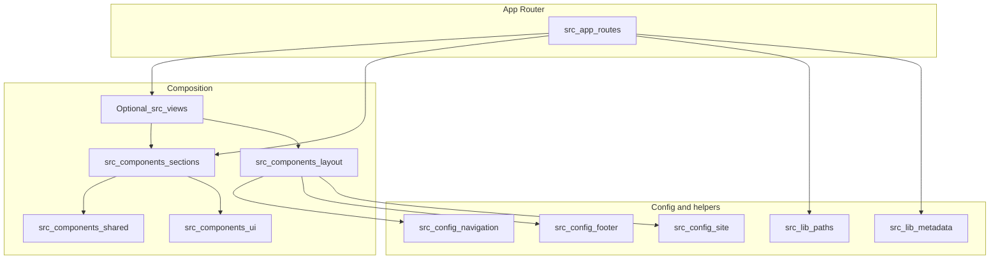

# System Architecture — Next.js (App Router)

This document is the source of truth for **how this stack is structured** and how data, config, and UI flow through the app. It applies to greenfield work in this repository unless a specific project documents exceptions.

---

## Stack

| Layer | Choice |
|--------|--------|
| Framework | Next.js (latest), **App Router only** (no Pages Router for new work) |
| Language | TypeScript — use **`"strict": true`** in `tsconfig.json` for new projects; if an existing app disables strict mode, add explicit runtime validation where types cannot be trusted |
| Styling | Tailwind CSS |
| Default rendering | **React Server Components** |
| Client UI | Client Components only when interaction or browser APIs require them |

Supporting libraries (e.g. Zod for API validation) should be added sparingly and only when they remove duplication or enforce boundaries.

---

## Canonical directory layout

Greenfield apps in this system follow this layout:

```txt
src/
  app/
    (route-groups)/
      layout.tsx
      page.tsx
    api/
      .../route.ts

  components/
    layout/       # Header, Footer, shell wrappers
    sections/     # Page-level blocks (Hero, Features, CTA, …)
    shared/       # Small reusable non-primitive pieces
    ui/           # Primitive UI building blocks

  config/
    site.ts
    navigation.ts
    footer.ts

  lib/
    paths.ts
    metadata.ts
    schema.ts     # Shared Zod schemas / JSON-LD helpers as needed
    utils.ts

  types/
```

**Route groups** (parentheses folders under `app/`) group routes without affecting the URL. Use them to share layouts for marketing vs. app areas.

**Optional larger apps:** You may introduce `src/views/` so that `app/**/page.tsx` stays thin and composes a single view per route. If present, the rule is: **routes own wiring; views own composition; components own presentation.**

---

## Single source of truth

These must not be duplicated or hardcoded in random components:

| Concern | Location |
|---------|-----------|
| URL paths / route constants | `src/lib/paths.ts` |
| Header / primary nav | `src/config/navigation.ts` |
| Footer links | `src/config/footer.ts` |
| Site name, URLs, social defaults | `src/config/site.ts` |
| Default SEO / metadata helpers | `src/lib/metadata.ts` |
| Structured data helpers | `src/lib/schema.ts` |

Related rules: [`config-first.mdc`](../rules/config-first.mdc), [`no-hardcoding-rule.mdc`](../rules/no-hardcoding-rule.mdc), [`routes-and-menus-rule.mdc`](../rules/routes-and-menus-rule.mdc).

---

## Required startup scaffold

Before feature work begins, initialize and use these files:

- `src/config/site.ts`
- `src/config/navigation.ts`
- `src/config/footer.ts`
- `src/lib/paths.ts`
- `src/lib/metadata.ts`
- `src/lib/schema.ts`

Feature work must build on this scaffold rather than bypassing it with inline constants.

---

## Route architecture guidance

- Use `src/lib/paths.ts` as the canonical route map.
- Avoid raw path strings in page sections, menus, or CTA components.
- Prefer helper functions for dynamic routes (e.g. `article(slug)`), not string concatenation.
- Keep baseline path entries available for core pages (`home`, `about`, `contact`) and extend from there.

---

## Request and composition flow



Public pages should pull **nav, footer, and path links** from config and `paths.ts`, not from string literals in JSX.

---

## Rendering model

- **Default:** Server Components for pages, layouts, and most sections.
- **Client Components:** Only when user interaction, animation control, or browser-only APIs require them. See [`server-component-first.mdc`](../rules/server-component-first.mdc).

Avoid:

- Marking entire layouts or pages as `"use client"` without a concrete reason.
- Large client subtrees that could be server-rendered.

---

## API routes (`app/api/**/route.ts`)

- Validate inputs with a shared schema (e.g. Zod) and reject invalid requests with consistent HTTP status codes.
- Return a **consistent JSON shape** for errors and success payloads across routes.
- Run secrets and server-only env access **only** in server contexts (route handlers, Server Actions, server components) — never expose secrets to the client bundle.

See [`api-validation-and-errors.mdc`](../rules/api-validation-and-errors.mdc) and [`env-and-secrets.mdc`](../rules/env-and-secrets.mdc).

---

## Security and operations baseline

- Apply security headers at the edge or app layer (e.g. CSP baseline, `X-Frame-Options`, `Referrer-Policy`, `X-Content-Type-Options`) based on deployment capabilities.
- Use middleware for cross-cutting concerns only: canonical host redirect, HTTPS normalization, locale/geo gates, coarse auth/allow rules.
- Keep middleware lightweight; avoid heavy DB calls or complex business logic in middleware.
- For forms and public endpoints: schema validation, spam/bot protection (honeypot, captcha, or provider controls), and basic rate limiting by IP or token.
- Return safe error payloads; never expose internal stack traces in public responses.

### Canonical host handling

- Define one canonical host (from `site.ts`/env).
- Redirect alternate hosts/protocols to canonical origin where required.
- Keep canonical URL generation consistent with this policy in metadata helpers.

### Environment variable guidance

- Include `.env.example` with all required variables and descriptions.
- Separate server-only secrets from public values (`NEXT_PUBLIC_*` only when truly public).
- Access env vars through focused server-side helpers when possible to avoid inconsistent naming/usage.

---

## SEO and UI consistency

- Every public page: metadata, semantic structure, one logical `<h1>`, sensible heading order. See [`seo-first.mdc`](../rules/seo-first.mdc).
- Reuse section and UI patterns; avoid one-off styling drift. See [`ui-consistency-rule.mdc`](../rules/ui-consistency-rule.mdc).

---

## Repository state vs this document

This repository may contain **documentation and rules only** (no `package.json`, `tsconfig.json`, or `src/` yet). In that case, treat the layout and TypeScript guidance above as the **target scaffold** for new work.

After a Next.js app is initialized here:

- Set `"strict": true` in `tsconfig.json` unless the project documents an exception (if strict is off, add explicit runtime validation where types are unreliable).
- Align the real `src/` tree with this document, or update this document to match an intentional deviation.

---

## Related documents

- [ANTI_PATTERNS.md](./ANTI_PATTERNS.md) — what not to do
- [MODULE_OUTPUT_FORMAT.md](./MODULE_OUTPUT_FORMAT.md) — plan template before writing code
